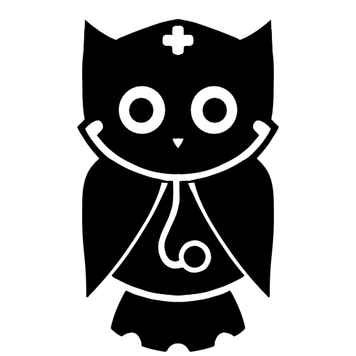

<div align="center">
	<a href="https://github.com/BlackKing72/api-owlpost"  style="filter: drop-shadow(0 0 1px #fafaff80)">
		
</a>
	<h3 align="center">Owlcalc</h3>
	<p align="center">
		Um minigame educativo desenvolvido para estudantes de enfermagem.
	</p>
</div>
<br/>

O Objetivo do app é ajudar os estudantes de enfermagem a resolver cálculos de medicamentos e gotejamento de soro, tudo de forma interativa e prática.

Foi criado usando React + Vite e algumas bibliotecas para facilitar o desenvolvimento.

Este projeto foi criado como parte de um trabalho escolar, Projeto Integrador (P.I), com o objetivo de demonstrar habilidades adquiridas no decorrer das unidades curriculares.

<br/>

## Como funciona

O app conduz o estudante passo a passo na resolução dos cálculos, até a solução final.

Os cálculos são divididos em etapas. Em cada etapa você precisa organizar os componentes da fórmula na ordem correta.

<br/>

## Tecnologias utilizadas


  


<br/>

## Melhorias futuras

- Simplificar o passo a passo para tornar o jogo mais simples e dinâmico.
- Corrigir bugs no drag and drop que prejudicam a experiência do usuário.
- Adicionar mais efeitos visuais e sonoros.
- Melhorar o feedback de algumas ações do usuário.
- Adicionar configurações de ambiente.
- Refinar a experiência no geral.

<br/>

## Autores


<br/>

## Como rodar o projeto

1. Clone o repositório:
```sh
git  clone  https://github.com/BlackKing72/owlcalc/
```

2. Acesse a pasta do projeto:
```sh
cd  owlcalc
```

3. Instale as dependências:
```sh
npm install
```

5. Inicie o servidor:
```sh
npm run dev
```

<br/>

## Sobre o Projeto Integrador

O P.I tem como objetivo resolver problemas reais utilizando habilidades adquiridas durante as unidades curriculares, incluindo hardware, redes de computadores e desenvolvimento de software.

O nosso projeto foi baseado em um desafio enfrentado pelas turmas de enfermagem, conteúdos teóricos que tornavam o aprendizado difícil e pouco interativo.

Nossa solução foi divida em duas partes:

### Owlpost

Como as turmas de enfermagem já tinham o costume de compartilharem conteúdos entre si, pensamos em algo que poderia facilitar isso. Uma plataforma colaborativa onde os estudantes podem compartilhar conteúdos relacionados às suas matérias e outros tópicos de interesse da turma.

### Owlcalc

Uma das maiores demandas das turmas de enfermagem. Um minigame educativo para ajudar os estudantes de enfermagem à resolverem os cálculos de medicamento e gotejamento de soro de forma prática e interativa.


[matheus-shield]: https://img.shields.io/badge/Matheus_Cruz-404040?style=for-the-badge&logo=github
[matheus-url]: https://github.com/BlackKing72

[michaell-shield]: https://img.shields.io/badge/Michaell_Senna-404040?style=for-the-badge&logo=github
[michaell-url]: https://github.com/thug-okami